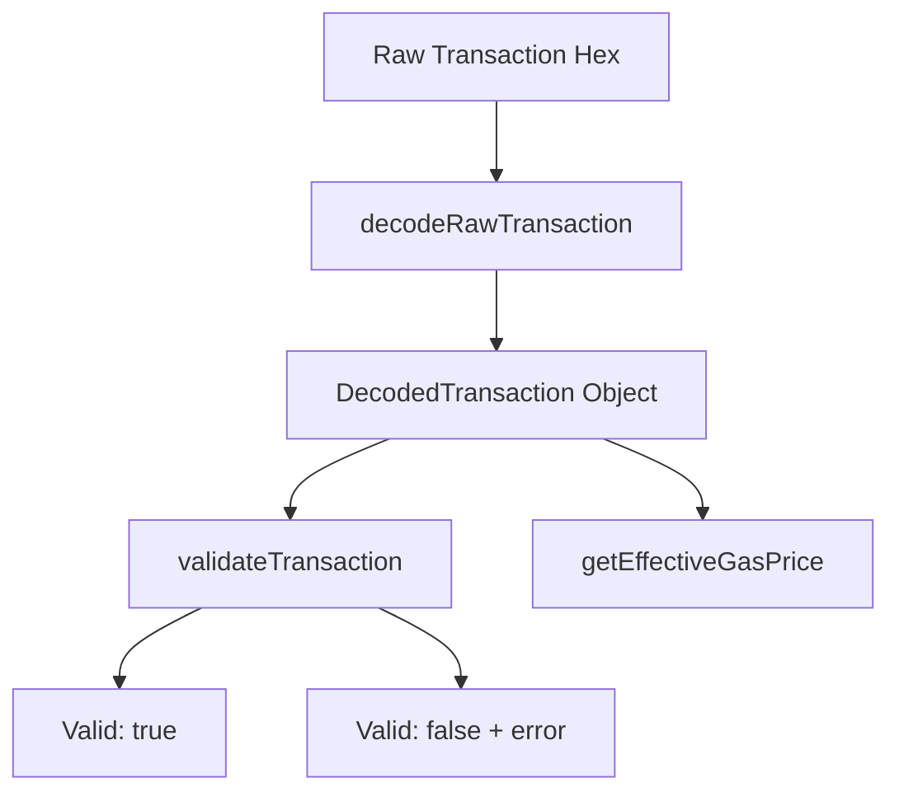
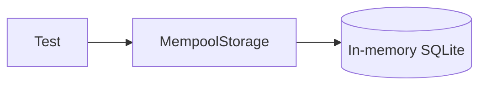
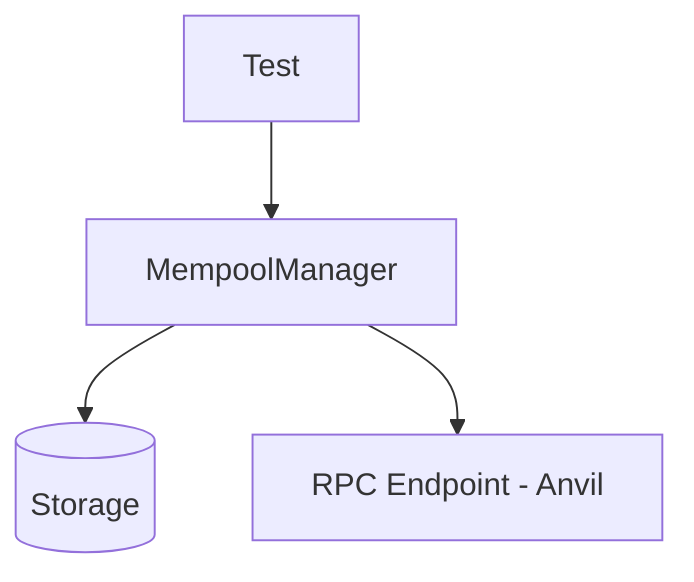
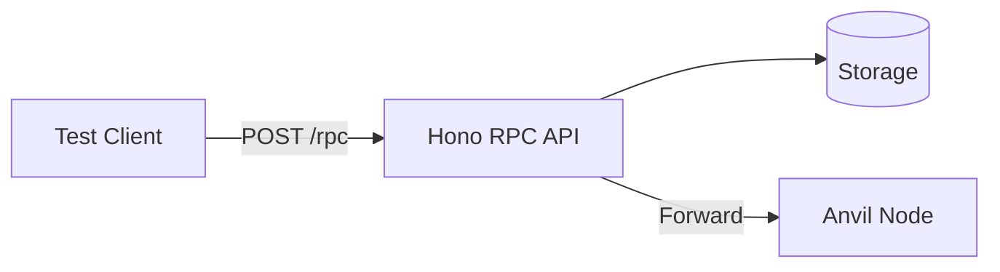

# Debug Mempool Proxy - Test Plan

## Overview

This document outlines the testing strategy for the Debug Mempool Proxy project. Tests will be added to `packages/server/test/` using Vitest with prool for Ethereum node integration.

## Project Context

This is a **Debug Mempool Proxy** - a JSON-RPC proxy that sits between a dApp and an Ethereum node (like Anvil). It intercepts `eth_sendRawTransaction` calls, stores transactions in a local mempool, and allows manual control over when transactions are forwarded to the actual node. This enables testing of mempool-related scenarios like transaction replacement, gas price filtering, and pending transaction visibility.

### Key Source Files to Test

| File | Purpose | Location |
|------|---------|----------|
| `decoder.ts` | Decodes raw signed transactions using viem | `packages/server/src/mempool/decoder.ts` |
| `filters.ts` | Applies filtering rules (gas price, replacements) | `packages/server/src/mempool/filters.ts` |
| `state.ts` | MempoolManager class - core orchestration | `packages/server/src/mempool/state.ts` |
| `storage/mempool.ts` | Database CRUD operations | `packages/server/src/storage/mempool.ts` |
| `api/rpc.ts` | JSON-RPC endpoint handler | `packages/server/src/api/rpc.ts` |
| `api/mempool.ts` | REST management API | `packages/server/src/api/mempool.ts` |
| `db.sql` | Database schema | `packages/server/src/schema/sql/db.sql` |

## Test Infrastructure

### Current Setup

- **Test Framework**: Vitest 4.x
- **Ethereum Node**: Anvil via prool (per-worker isolation on port 5051)
- **viem**: For transaction creation and blockchain interaction
- **Test Accounts**: Anvil default funded accounts

### Required Additions

1. **In-memory SQLite** using `remote-sql-libsql` + `@libsql/client`
   - Same approach as the nodejs platform
   - Use `:memory:` URL for in-memory database
   - Schema applied from `src/schema/sql/db.sql`

## Test Categories

### 1. Transaction Decoder Tests (`test/mempool/decoder.test.ts`)

Test the transaction decoding logic in [`decoder.ts`](../packages/server/src/mempool/decoder.ts:29).



**Test Cases:**

| Test | Description | Input | Expected |
|------|-------------|-------|----------|
| Decode legacy tx | Parse legacy transaction | Signed legacy tx | Correct hash, from, to, nonce, gasPrice |
| Decode EIP-1559 tx | Parse type-2 transaction | Signed EIP-1559 tx | maxFeePerGas, maxPriorityFeePerGas fields |
| Decode EIP-2930 tx | Parse type-1 transaction | Signed EIP-2930 tx | accessList, gasPrice fields |
| Decode contract creation | Parse tx with no 'to' | Contract deploy tx | to: null, data present |
| Validate valid tx | Basic validation | Valid decoded tx | `{valid: true}` |
| Validate missing from | Invalid signature | Corrupted tx | `{valid: false, error: 'Invalid signature'}` |
| Validate negative nonce | Invalid nonce | tx with nonce < 0 | `{valid: false, error: 'Invalid nonce'}` |
| Validate zero gas | Invalid gas limit | tx with gasLimit = 0 | `{valid: false, error: 'Invalid gas limit'}` |
| Effective gas - legacy | Get gas price | Legacy tx | Returns gasPrice |
| Effective gas - EIP1559 | Get gas price | EIP-1559 tx | Returns maxFeePerGas |

---

### 2. Filter Logic Tests (`test/mempool/filters.test.ts`)

Test filtering rules in [`filters.ts`](../packages/server/src/mempool/filters.ts:17).

**Test Cases:**

| Test | Description | Setup | Expected |
|------|-------------|-------|----------|
| Accept above min gas | Gas above threshold | minGasPrice: 1 gwei, tx: 2 gwei | `{accepted: true, action: 'accept'}` |
| Reject below min gas | Gas below threshold | minGasPrice: 10 gwei, tx: 1 gwei | `{accepted: false, action: 'reject'}` |
| Accept replacement tx | Higher gas replacement | Existing tx @ 1 gwei, new tx @ 2 gwei | Accept, mark old as replaced |
| Reject low replacement | Insufficient gas bump | Existing tx @ 1 gwei, new tx @ 1.05 gwei | `{accepted: false}` - need 10% increase |
| Check nonce gap | Detect missing nonces | On-chain: 5, pending: 7 | `{hasGap: true, expectedNonce: 5}` |
| No nonce gap | Sequential nonces | On-chain: 5, pending: 5,6,7 | `{hasGap: false}` |

---

### 3. Storage Layer Tests (`test/storage/mempool.test.ts`)

Test database operations in [`mempool.ts`](../packages/server/src/storage/mempool.ts:13).

**Prerequisites**: In-memory SQLite with schema applied



**Test Cases:**

| Test | Description | Operation | Verification |
|------|-------------|-----------|--------------|
| Add transaction | Insert new tx | `addTransaction(tx)` | `getTransaction(hash)` returns tx |
| Get by hash | Retrieve single tx | `getTransaction(hash)` | Returns correct transaction |
| Get pending | List pending only | `getPendingTransactions()` | Only status='pending' returned |
| Filter by sender | Query by address | `getTransactionsBySender(addr)` | Returns sender's txs only |
| Filter by gas price | Min/max gas filter | `getPendingTransactions({minGasPrice})` | Filtered results |
| Update to forwarded | Change status | `updateStatus(hash, 'forwarded')` | forwarded_at set |
| Update to dropped | Change status | `updateStatus(hash, 'dropped', reason)` | dropped_at, drop_reason set |
| Remove transaction | Delete tx | `removeTransaction(hash)` | `getTransaction(hash)` returns null |
| Clear pending | Delete all pending | `clearPending()` | Empty pending list |
| Get statistics | Aggregate stats | `getStats()` | Correct counts |
| State get/set | Key-value store | `setState`, `getState` | Values persisted |
| Min gas price | Convenience method | `setMinGasPrice`, `getMinGasPrice` | BigInt roundtrip |
| Auto forward | Convenience method | `setAutoForward`, `isAutoForward` | Boolean roundtrip |

---

### 4. Mempool Manager Tests (`test/mempool/state.test.ts`)

Integration tests for [`MempoolManager`](../packages/server/src/mempool/state.ts:14).

**Prerequisites**: In-memory SQLite + Mock/Real RPC endpoint



**Test Cases:**

| Test | Description | Setup | Expected |
|------|-------------|-------|----------|
| Process valid tx | Full happy path | Auto-forward off | Tx stored, hash returned |
| Process + auto-forward | Forward on accept | Auto-forward on | Tx stored + forwarded to node |
| Process invalid tx | Decode failure | Malformed rawTx | JSON-RPC error returned |
| Process rejected tx | Below gas threshold | minGasPrice: 100 gwei | JSON-RPC error with reason |
| Force include | Manual forward | Pending tx exists | Tx forwarded, status updated |
| Force include - not found | Missing tx | Invalid hash | Error returned |
| Drop transaction | Manual drop | Pending tx exists | Status = dropped |
| Drop - already processed | Non-pending tx | Forwarded tx | Returns false |
| Flush pending | Forward all | Multiple pending | All forwarded in nonce order |
| Get state | Current config | Various settings | Correct minGasPrice, autoForward |

---

### 5. RPC Proxy Integration Tests (`test/api/rpc.test.ts`)

End-to-end tests for the RPC endpoint using real Anvil node.

**Prerequisites**: Anvil running, in-memory SQLite



**Test Cases:**

| Test | Description | Method | Expected |
|------|-------------|--------|----------|
| Forward eth_chainId | Pass-through call | eth_chainId | Returns chain ID |
| Forward eth_blockNumber | Pass-through call | eth_blockNumber | Returns block number |
| Intercept sendRawTx | Store in mempool | eth_sendRawTransaction | Hash returned, stored locally |
| getTransactionByHash - pending | Local mempool lookup | eth_getTransactionByHash | Returns pending tx from local |
| getTransactionByHash - confirmed | Forward to node | eth_getTransactionByHash | Returns from node |
| getTransactionCount - pending | Include local pending | eth_getTransactionCount | Accounts for local txs |
| Invalid JSON-RPC | Parse error | Malformed JSON | Error -32700 |
| Missing method | Invalid request | No method field | Error -32600 |
| Missing RPC_URL | Config error | Unset env | Error -32603 |

---

### 6. Management API Tests (`test/api/mempool.test.ts`)

Tests for the REST management API.

**Test Cases:**

| Test | Endpoint | Method | Expected |
|------|----------|--------|----------|
| Get state | `/api/mempool/state` | GET | Returns minGasPrice, autoForward |
| Set gas price | `/api/mempool/gas-price` | POST | Updates minGasPrice |
| Invalid gas price | `/api/mempool/gas-price` | POST | 400 error |
| Set auto-forward | `/api/mempool/auto-forward` | POST | Updates autoForward |
| Get stats | `/api/mempool/stats` | GET | Returns counts |
| List pending | `/api/mempool/pending` | GET | Returns pending txs |
| List with filter | `/api/mempool/pending?from=0x...` | GET | Filtered results |
| Get history | `/api/mempool/history` | GET | Returns all statuses |
| Get single tx | `/api/mempool/tx/:hash` | GET | Returns tx details |
| Get tx - not found | `/api/mempool/tx/:hash` | GET | 404 error |
| Get by sender | `/api/mempool/sender/:address` | GET | Returns sender's txs |
| Include tx | `/api/mempool/include/:hash` | POST | Forwards tx |
| Include - not found | `/api/mempool/include/:hash` | POST | 400 error |
| Drop tx | `/api/mempool/drop/:hash` | POST | Drops tx |
| Drop - not found | `/api/mempool/drop/:hash` | POST | 404 error |
| Batch include | `/api/mempool/include-batch` | POST | Forwards multiple |
| Batch drop | `/api/mempool/drop-batch` | POST | Drops multiple |
| Flush all | `/api/mempool/flush` | POST | Forwards all pending |
| Clear pending | `/api/mempool/clear` | DELETE | Removes all pending |

---

## Test File Structure

```
packages/server/test/
├── basic.test.ts           # Existing basic test
├── setup.ts                # Test environment setup
├── helpers.ts              # Helper utilities
├── prool/
│   ├── globalSetup.ts      # Prool/Anvil startup
│   ├── node-instances.ts   # Anvil server config
│   └── url.ts              # RPC URL generation
├── utils/
│   ├── data.ts             # Test fixtures
│   ├── index.ts            # Utility exports
│   └── db.ts               # NEW: In-memory SQLite setup
├── mempool/
│   ├── decoder.test.ts     # NEW: Decoder tests
│   ├── filters.test.ts     # NEW: Filter tests
│   └── state.test.ts       # NEW: MempoolManager tests
├── storage/
│   └── mempool.test.ts     # NEW: Storage layer tests
└── api/
    ├── rpc.test.ts         # NEW: RPC proxy tests
    └── mempool.test.ts     # NEW: Management API tests
```

---

## Implementation Priority

1. **Phase 1: Database Setup**
   - Add SQLite dependency for tests
   - Create `test/utils/db.ts` with in-memory DB helper

2. **Phase 2: Unit Tests**
   - `decoder.test.ts` - Pure functions, no dependencies
   - `filters.test.ts` - Requires mock storage

3. **Phase 3: Storage Tests**
   - `storage/mempool.test.ts` - Uses in-memory SQLite

4. **Phase 4: Integration Tests**
   - `mempool/state.test.ts` - Storage + RPC
   - `api/rpc.test.ts` - Full RPC flow
   - `api/mempool.test.ts` - Full API flow

---

## Test Utilities Needed

### 1. In-memory Database Helper (`test/utils/db.ts`)

```typescript
import {createClient} from '@libsql/client';
import {RemoteLibSQL} from 'remote-sql-libsql';
import {readFileSync} from 'fs';
import {join} from 'path';

export async function createTestDatabase(): Promise<RemoteLibSQL> {
  // Create in-memory libsql client
  const client = createClient({url: ':memory:'});
  const remoteSQL = new RemoteLibSQL(client);
  
  // Load and execute schema
  const schemaPath = join(__dirname, '../../src/schema/sql/db.sql');
  const schema = readFileSync(schemaPath, 'utf-8');
  
  // Execute each statement separately (libsql requires this)
  const statements = schema.split(';').filter(s => s.trim());
  for (const stmt of statements) {
    await remoteSQL.exec(stmt);
  }
  
  return remoteSQL;
}
```

### 2. Transaction Generator (`test/utils/tx.ts`)

```typescript
import {
  createWalletClient,
  http,
  serializeTransaction,
  signTransaction,
  type Address,
  type Hex,
  parseGwei,
} from 'viem';
import {privateKeyToAccount} from 'viem/accounts';
import {TEST_PRIVATE_KEY} from '../setup';

export async function createSignedTransaction(params: {
  to?: Address;
  value?: bigint;
  nonce: number;
  gasPrice?: bigint;
  maxFeePerGas?: bigint;
  maxPriorityFeePerGas?: bigint;
  gasLimit?: bigint;
  data?: Hex;
  chainId: number;
}): Promise<Hex> {
  const account = privateKeyToAccount(TEST_PRIVATE_KEY);
  
  // Sign based on transaction type
  if (params.maxFeePerGas) {
    // EIP-1559 transaction
    return account.signTransaction({
      type: 'eip1559',
      to: params.to,
      value: params.value ?? 0n,
      nonce: params.nonce,
      maxFeePerGas: params.maxFeePerGas,
      maxPriorityFeePerGas: params.maxPriorityFeePerGas ?? parseGwei('1'),
      gas: params.gasLimit ?? 21000n,
      data: params.data,
      chainId: params.chainId,
    });
  } else {
    // Legacy transaction
    return account.signTransaction({
      type: 'legacy',
      to: params.to,
      value: params.value ?? 0n,
      nonce: params.nonce,
      gasPrice: params.gasPrice ?? parseGwei('1'),
      gas: params.gasLimit ?? 21000n,
      data: params.data,
      chainId: params.chainId,
    });
  }
}
```

### 3. Hono Test Client

```typescript
// Use Hono's testClient for API testing
import {testClient} from 'hono/testing';
```

---

## Dependencies to Add

```json
{
  "devDependencies": {
    "@libsql/client": "^0.15.0",
    "remote-sql-libsql": "^0.0.6"
  }
}
```

---

## Running Tests

```bash
# Run all tests
pnpm --filter purgatory-core test

# Run specific test file
pnpm --filter purgatory-core test test/mempool/decoder.test.ts

# Run with coverage
pnpm --filter purgatory-core test -- --coverage
```

---

## Implementation Context for Fresh Start

### Test Accounts (Anvil Default)

These accounts are pre-funded in Anvil and defined in `test/setup.ts`:

```typescript
// Account 1 - Deployer
export const TEST_DEPLOYER_ADDRESS = '0xf39Fd6e51aad88F6F4ce6aB8827279cffFb92266';
export const TEST_DEPLOYER_PRIVATE_KEY = '0xac0974bec39a17e36ba4a6b4d238ff944bacb478cbed5efcae784d7bf4f2ff80';

// Account 2 - Test address
export const TEST_ADDRESS = '0x70997970C51812dc3A010C7d01b50e0d17dc79C8';
export const TEST_PRIVATE_KEY = '0x59c6995e998f97a5a0044966f0945389dc9e86dae88c7a8412f4603b6b78690d';

// Account 3 - Recipient
export const TEST_RECIPIENT = '0x3C44CdDdB6a900fa2b585dd299e03d12FA4293BC';
```

### Existing Test Infrastructure

The prool setup provides:
- **RPC URL**: `http://localhost:5051/{poolId}` where poolId is unique per Vitest worker
- **Anvil chain ID**: 31337
- **Global setup**: `test/prool/globalSetup.ts` starts/stops Anvil
- **Test context**: `getTestContext()` returns `{chain, rpcUrl, walletClient, publicClient, accounts}`

### Key Imports for Tests

```typescript
// For decoder tests
import {decodeRawTransaction, validateTransaction, getEffectiveGasPrice} from '../../src/mempool/decoder.js';

// For filter tests
import {applyFilters, checkNonceGap, FilterContext} from '../../src/mempool/filters.js';

// For storage tests
import {MempoolStorage} from '../../src/storage/mempool.js';

// For state tests
import {MempoolManager} from '../../src/mempool/state.js';

// For API tests
import {createServer} from '../../src/index.js';
```

### Example Test Implementations

#### Decoder Test Example

```typescript
// test/mempool/decoder.test.ts
import {describe, it, expect, beforeAll} from 'vitest';
import {decodeRawTransaction, validateTransaction} from '../../src/mempool/decoder.js';
import {createSignedTransaction} from '../utils/tx.js';
import {getTestContext, setupTestEnvironment} from '../setup.js';
import {parseGwei, parseEther} from 'viem';

describe('Transaction Decoder', () => {
  let chainId: number;
  
  beforeAll(async () => {
    const ctx = await setupTestEnvironment();
    chainId = ctx.chain.id;
  });
  
  describe('decodeRawTransaction', () => {
    it('decodes legacy transaction', async () => {
      const rawTx = await createSignedTransaction({
        to: '0x3C44CdDdB6a900fa2b585dd299e03d12FA4293BC',
        value: parseEther('1'),
        nonce: 0,
        gasPrice: parseGwei('10'),
        chainId,
      });
      
      const decoded = await decodeRawTransaction(rawTx);
      
      expect(decoded.txType).toBe('legacy');
      expect(decoded.from).toBe('0x70997970c51812dc3a010c7d01b50e0d17dc79c8'); // lowercase
      expect(decoded.to).toBe('0x3c44cdddb6a900fa2b585dd299e03d12fa4293bc');
      expect(decoded.value).toBe(parseEther('1'));
      expect(decoded.gasPrice).toBe(parseGwei('10'));
    });
    
    it('decodes EIP-1559 transaction', async () => {
      const rawTx = await createSignedTransaction({
        to: '0x3C44CdDdB6a900fa2b585dd299e03d12FA4293BC',
        value: parseEther('1'),
        nonce: 0,
        maxFeePerGas: parseGwei('20'),
        maxPriorityFeePerGas: parseGwei('2'),
        chainId,
      });
      
      const decoded = await decodeRawTransaction(rawTx);
      
      expect(decoded.txType).toBe('eip1559');
      expect(decoded.maxFeePerGas).toBe(parseGwei('20'));
      expect(decoded.maxPriorityFeePerGas).toBe(parseGwei('2'));
    });
  });
});
```

#### Storage Test Example

```typescript
// test/storage/mempool.test.ts
import {describe, it, expect, beforeEach} from 'vitest';
import {MempoolStorage} from '../../src/storage/mempool.js';
import {createTestDatabase} from '../utils/db.js';
import type {Hash, Address} from 'viem';

describe('MempoolStorage', () => {
  let storage: MempoolStorage;
  
  beforeEach(async () => {
    const db = await createTestDatabase();
    storage = new MempoolStorage(db);
  });
  
  it('adds and retrieves a transaction', async () => {
    const tx = {
      hash: '0x1234...' as Hash,
      rawTx: '0xf86c...' as `0x${string}`,
      from: '0x70997970c51812dc3a010c7d01b50e0d17dc79c8' as Address,
      to: '0x3c44cdddb6a900fa2b585dd299e03d12fa4293bc' as Address,
      nonce: 0,
      gasPrice: 10000000000n,
      gasLimit: 21000n,
      value: 1000000000000000000n,
      data: null,
      chainId: 31337,
      txType: 'legacy' as const,
    };
    
    await storage.addTransaction(tx);
    const retrieved = await storage.getTransaction(tx.hash);
    
    expect(retrieved).not.toBeNull();
    expect(retrieved!.hash).toBe(tx.hash);
    expect(retrieved!.status).toBe('pending');
  });
});
```

#### RPC API Test Example

```typescript
// test/api/rpc.test.ts
import {describe, it, expect, beforeAll, beforeEach} from 'vitest';
import {createServer} from '../../src/index.js';
import {createTestDatabase} from '../utils/db.js';
import {getTestContext, setupTestEnvironment} from '../setup.js';
import {MempoolStorage} from '../../src/storage/mempool.js';
import {createSignedTransaction} from '../utils/tx.js';
import {parseGwei} from 'viem';

describe('RPC API', () => {
  let app: ReturnType<typeof createServer>;
  let storage: MempoolStorage;
  let rpcUrl: string;
  
  beforeAll(async () => {
    const ctx = await setupTestEnvironment();
    rpcUrl = ctx.rpcUrl;
  });
  
  beforeEach(async () => {
    const db = await createTestDatabase();
    storage = new MempoolStorage(db);
    
    app = createServer({
      getDB: () => db,
      getEnv: () => ({RPC_URL: rpcUrl}),
    });
  });
  
  it('forwards eth_chainId to upstream', async () => {
    const res = await app.request('/rpc', {
      method: 'POST',
      headers: {'Content-Type': 'application/json'},
      body: JSON.stringify({
        jsonrpc: '2.0',
        id: 1,
        method: 'eth_chainId',
        params: [],
      }),
    });
    
    const json = await res.json();
    expect(json.result).toBe('0x7a69'); // 31337 in hex
  });
  
  it('intercepts eth_sendRawTransaction', async () => {
    // First disable auto-forward
    await storage.setAutoForward(false);
    
    const rawTx = await createSignedTransaction({
      to: '0x3C44CdDdB6a900fa2b585dd299e03d12FA4293BC',
      value: 1000000000000000000n,
      nonce: 0,
      gasPrice: parseGwei('10'),
      chainId: 31337,
    });
    
    const res = await app.request('/rpc', {
      method: 'POST',
      headers: {'Content-Type': 'application/json'},
      body: JSON.stringify({
        jsonrpc: '2.0',
        id: 1,
        method: 'eth_sendRawTransaction',
        params: [rawTx],
      }),
    });
    
    const json = await res.json();
    expect(json.result).toMatch(/^0x[a-f0-9]{64}$/); // Returns tx hash
    
    // Verify stored in local mempool
    const stored = await storage.getTransaction(json.result);
    expect(stored).not.toBeNull();
    expect(stored!.status).toBe('pending');
  });
});
```

### Important Implementation Notes

1. **Database per test**: Create a fresh in-memory database in `beforeEach` for isolation
2. **Chain ID**: Anvil uses chain ID 31337 (0x7a69)
3. **Addresses lowercase**: The decoder normalizes addresses to lowercase
4. **Async decode**: `decodeRawTransaction` is async due to signature recovery
5. **Schema execution**: The `db.sql` file uses SQLite syntax with `IF NOT EXISTS`
6. **BigInt handling**: Storage converts bigints to strings for SQLite, back to bigint on read
7. **Hono testing**: Use `app.request()` directly instead of `testClient` for simpler setup

### Type Definitions Reference

```typescript
// From src/mempool/types.ts
type TransactionStatus = 'pending' | 'forwarded' | 'dropped' | 'replaced';
type TransactionType = 'legacy' | 'eip2930' | 'eip1559' | 'eip4844';

interface PendingTransaction {
  hash: Hash;
  rawTx: Hex;
  from: Address;
  to: Address | null;
  nonce: number;
  gasPrice?: bigint;
  maxFeePerGas?: bigint;
  maxPriorityFeePerGas?: bigint;
  gasLimit: bigint;
  value: bigint;
  data: Hex | null;
  chainId?: number;
  txType: TransactionType;
  status: TransactionStatus;
  createdAt: number;
  forwardedAt?: number;
  droppedAt?: number;
  dropReason?: string;
}
```

### Checklist Before Implementation

- [ ] Add `@libsql/client` and `remote-sql-libsql` to devDependencies in `packages/server/package.json`
- [ ] Run `pnpm install` to update dependencies
- [ ] Create `test/utils/db.ts` with `createTestDatabase()` function
- [ ] Create `test/utils/tx.ts` with `createSignedTransaction()` function
- [ ] Start with decoder tests (pure functions, easiest to test)
- [ ] Then storage tests (need db.ts helper)
- [ ] Finally integration tests (need both db and Anvil)
